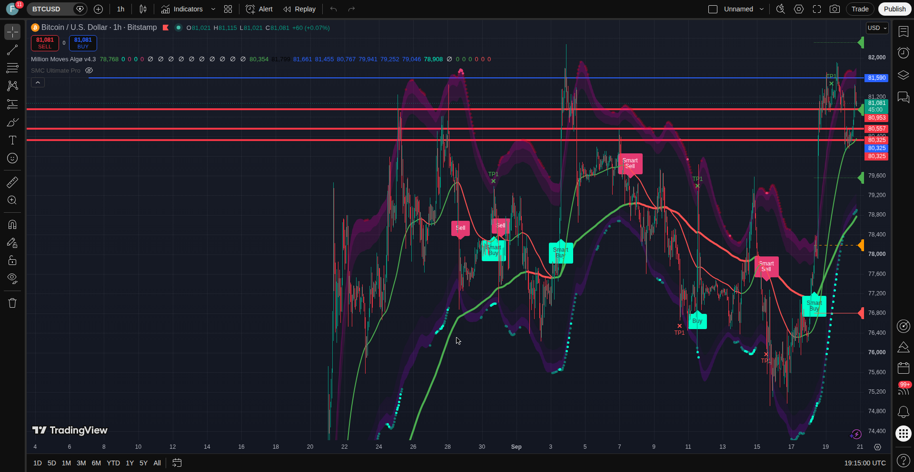
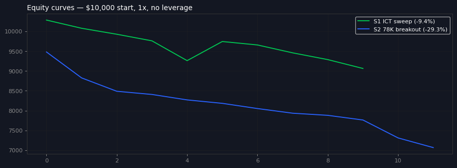
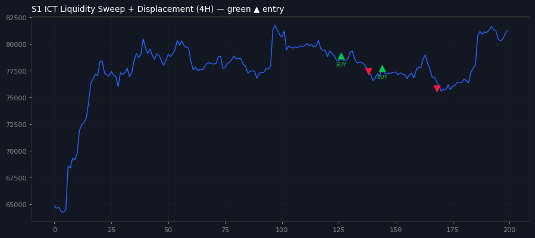
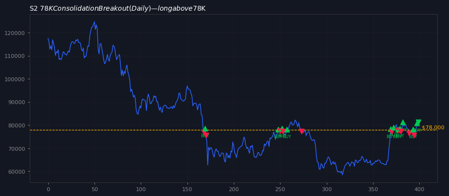
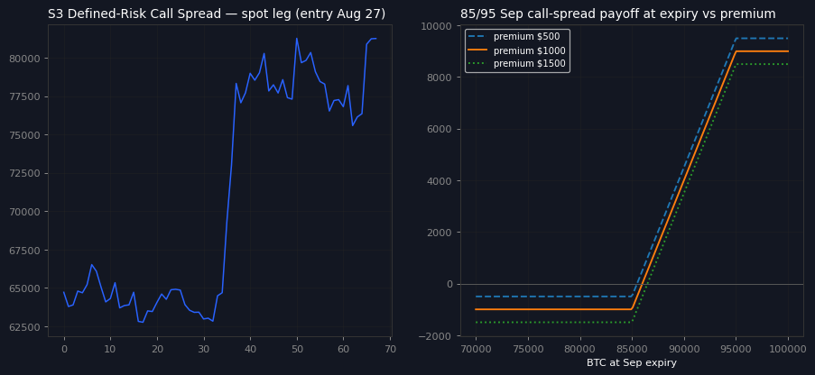
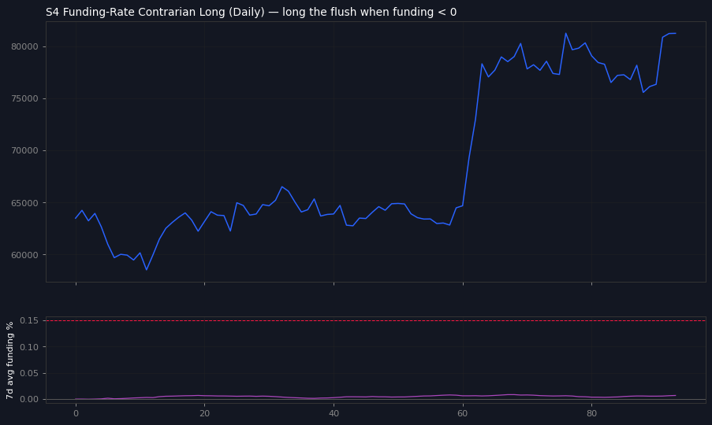
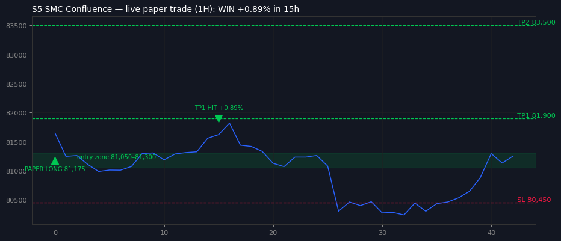

# BTC Trade Analysis


A complete Bitcoin trade setup study: live TradingView chart analysis, five backtested Pine Script strategies, and a demo execution brief for an Exness MT5 trial account.

---

## Chart Setup — BITSTAMP:BTCUSD (1H)



Hand-drawn technical setup on the 1-hour chart, marked 20 Sep 2026:

| Element | Level |
|---|---|
| Demand zone | **$80,950 – $81,180** |
| Stop-loss region | **$80,325 – $80,953** |
| Take-profit line | **$81,590** |
| Reference ray | **$78,000** |

---

## Demo Trade — Execution Brief

Prepared for manual placement on **Exness MT5 Trial** (`Exness-MT5Trial15`).

| Parameter | Value |
|---|---|
| Symbol | BTCUSD (or BTCUSDm) |
| Direction | **BUY** — market execution |
| Entry reference | ~$81,081 |
| Stop Loss | **80,450** |
| Take Profit | **81,900** |
| Risk | 1% of equity |
| Volume formula | `(Equity × 0.01) ÷ (Entry − 80450)`, rounded down |
| Example | $10,000 equity @ 81,081 → **0.15 lots** |

**Placement guards:** do not execute if spread > $150 or price is outside $80,000 – $82,000.

### Rationale

- **$80,600 reclaim** — the bullish trigger level; price holding above it keeps the long bias intact.
- **Demand zone $80,950–81,180** acting as near-term support beneath price.
- **Trader consensus** across five followed analysts (Sep 2026): reclaiming $80.6K opens a run higher; $82.3K flagged as the remaining high and leverage-flush danger zone — hence TP placed below it.
- **Risk discipline:** fixed 1% equity risk, hard stop, no averaging.

---

## Backtested Strategies

Five strategies simulated on historical data (1,000 daily candles, Dec 2023 – Sep 2026; 1× spot, no fees/slippage). **These are simulations, not realized profits.**

| # | Strategy | Trades | Win rate | Return | Max DD |
|---|---|---|---|---|---|
| S1 | ICT liquidity sweep | 10 | 20% | −9.36% | −11.88% |
| S2 | $78K breakout | 12 | 0% | −29.34% | −25.46% |
| S3 | Call-spread map (spot leg) | 1 | 100% | +1.21% | — |
| S4 | Funding contrarian | 0 | — | no setups | — |
| S5 | SMC confluence bounce | 1 | TP1 hit | **+0.89%** | — |

**S5 retrospective (the winner):** entered $81,175 on 19 Sep 2026, TP1 hit at **$81,900** fifteen hours later (+0.89%). Holding for TP2 ($83,500) would have stopped out on Sep 20 — a clean lesson in taking the first target.

Full interactive report: [`docs/btc-x-strategies-lab.html`](docs/btc-x-strategies-lab.html) · Data audit: [`docs/SOURCES.md`](docs/SOURCES.md)

### Equity & signal charts



| S1 | S2 | S3 |
|---|---|---|
|  |  |  |

| S4 | S5 |
|---|---|
|  |  |

---

## Pine Script

`strategies/smc_confluence_bounce.pine` — the SMC confluence strategy in Pine Script v5. Paste it into the TradingView Pine Editor to overlay the signals directly on your chart.

Raw backtest data: [`strategies/backtest-results.json`](strategies/backtest-results.json)

---

## Repository structure

```
btc-trade-analysis/
├── README.md
├── assets/
│   ├── tradingview-btc-setup.png   # 1H chart with hand-drawn setup
│   └── btc-chart-marked.png        # Marked analysis chart
├── strategies/
│   ├── smc_confluence_bounce.pine  # Pine Script v5 strategy
│   └── backtest-results.json       # Raw simulation results
├── charts/
│   ├── equity.png                  # Combined equity curve
│   └── strategy-s1..s5.png         # Per-strategy charts
└── docs/
    ├── btc-x-strategies-lab.html   # Full interactive lab report
    └── SOURCES.md                  # Data source audit
```

---

## Disclaimer

This repository is for **educational purposes only**. All trades described were planned on a **demo account** with no real capital at risk. Backtest results are historical simulations and do not guarantee future performance. Nothing here is financial advice — do your own research before trading real money.
